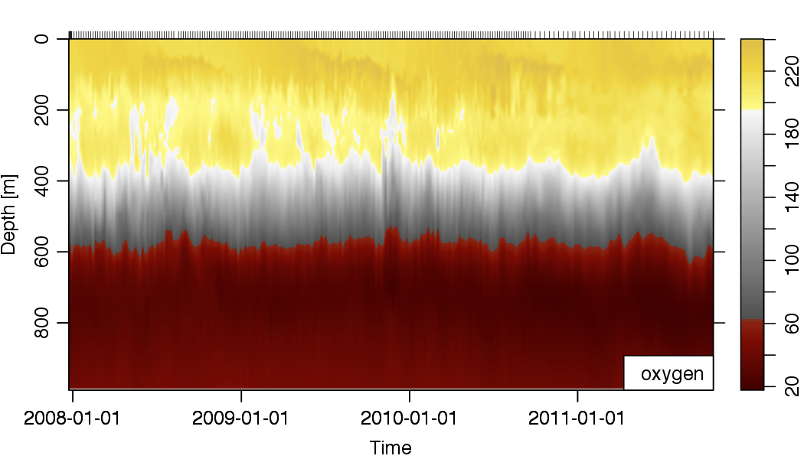

# Read MBARI BioArgo files into R

This package provides the facility to read the [MBARI BioArgo float data](http://www.mbari.org/science/upper-ocean-systems/chemical-sensor-group/floatviz/) into R, using the `argo` class inherited from the [`oce` package](http://dankelley.github.io/oce/).

## Installation

The `bioArgo` package is not currently on CRAN. The best way to install `bioArgo` is to use the `devtools` package:
```r
## install.packages('devtools')
library(devtools)
install_github('richardsc/bioArgo', ref='master')
```

## Example

Load one of the included data files, and plot an oxygen section using a [`cmocean`](http://matplotlib.org/cmocean/) colour scheme:
```r
library(oce)
library(mbari)
d <- read.bioArgo('inst/extdata/5145HawaiiQc.txt')
plot(as.section(d), which='oxygen', xtype='time', ztype='image', zcol=oceColorsOxygen)
```


It is also possible to read the file straight from the MBARI website, by specifying the name along with the `url=TRUE` argument:
```r
d <- read.bioArgo('5145HawaiiQC.txt', url=TRUE)
```

## Available files

A list of [available data files](http://www3.mbari.org/lobo/data/floatvizdata/floatvizconfig.txt) is below. Note that some files have "QC" versions, where the filename is modified like `5145HawaiiQC.TXT`. See the full list with detailed information at [http://www3.mbari.org/chemsensor/FloatList.html](http://www3.mbari.org/chemsensor/FloatList.html)

```
4900093.TXT
5900952.TXT
5901069.TXT
5901336.TXT
5145MtyBay.TXT
5145Hawaii.TXT
5146SoOcn.TXT
5143STNP.TXT
5426DRAKEPASS.TXT
6401MTYBAY.TXT
6401HAWAII.TXT
6391BERMUDA.TXT
6891HAWAII.TXT
6400STNP.TXT
6976BERMUDA.TXT
6403HAWAII.TXT
6972STNP.TXT
7564ARCTIC.TXT
6966HAWAII.TXT
6975BERMUDA.TXT
7622HAWAII.TXT
6967SOATLANTIC.TXT
6381ARABIANSEA.TXT
7601STNP.TXT
0068ROSSSEA.TXT
6968SOOCN.TXT
7552SOOCN.TXT
7558ETNP.TXT
6960ETNP.TXT
8374HOT.TXT
7597HAWAII.TXT
7593HAWAII.TXT
7596ARCTIC.TXT
7663BERMUDA.TXT
7672HAWAII.TXT
7647CALCURRENT.TXT
7553SoPacific.Txt
0069BERMUDA.TXT
7550BAYOFBENGAL.TXT
6881STNP.TXT
8497HAWAII.TXT
7674KUROSHIO.TXT
7546KUROSHIO.TXT
7619SOOCN.TXT
7620SOOCN.TXT
8486MTYBAY.TXT
8486HAWAII.TXT
7641STNP.TXT
7642NOPACIFIC.TXT
7698NOPACIFIC.TXT
7618CALCURRENT.TXT
7615CALCURRENT.TXT
8514HAWAII.TXT
0276NOATLANTIC.TXT
6091SOOCN.TXT
7557SOOCN.TXT
7567SOOCN.TXT
7613SOOCN.TXT
7614SOOCN.TXT
9091SOOCN.TXT
9092SOOCN.TXT
9031SOOCN.TXT
9018SOOCN.TXT
9095SOOCN.TXT
9101SOOCN.TXT
9254SOOCN.TXT
0412HAWAII.TXT
0037SOOCN.TXT
0508SOOCN.TXT
9313SOOCN.TXT
9096SOOCN.TXT
0509SOOCN.TXT
7652SOOCN.TXT
0511SOOCN.TXT
9094SOOCN.TXT
9275SOOCN.TXT
9099SOOCN.TXT
9260SOOCN.TXT
9125SOOCN.TXT
8514SOOCN.TXT
9274MTYBAY.TXT
9265MTYBAY.TXT
9274HAWAII.TXT
9668SOOCN.TXT
9666SOOCN.TXT
9646SOOCN.TXT
9657SOOCN.TXT
9652SOOCN.TXT
9655SOOCN.TXT
9662SOOCN.TXT
9749SOOCN.TXT
9645SOOCN.TXT
9757SOOCN.TXT
0506SOOCN.TXT
8501CALCURRENT.TXT
0507SOOCN.TXT
0564SOOCN.TXT
0510SOOCN.TXT
9602SOOCN.TXT
9637SOOCN.TXT
9650SOOCN.TXT
9600SOOCN.TXT
```
